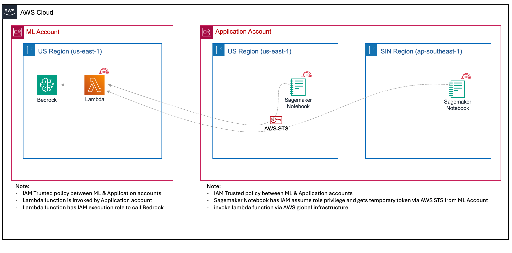

# Streaming Large Language Models with Amazon Bedrock in Multi-Account Setup

In organizations, it is common to have a data scientist or machine learning team collaborating with diverse application teams to contribute to AI-enabled applications or workloads. Typically, the two teams share responsibilities, with the machine learning team taking full responsibility for:

- Providing a consistent API as a service to diverse application teams
- Guaranteeing the scalability of the provided API
- Unifying the API and hiding the underlying implementation details
- Being fully responsible for updates and deprecating the model

Following this common pattern, we provide illustrative code on how to access Amazon Bedrock Large Language Models across accounts.

## Solution Components
The solution relies on the following components:

1. Adapter Layer: An additional layer of adapter (AWS Lambda) is used to unify the services. The source code for the adapter can be found in ./bedrock-account/src.

2. Cross-Account Role: A cross-account role with the necessary policy is defined in ./bedrock-account/policy_example. This role allows the client account to invoke Lambda APIs in the Bedrock account.

3. Remote Client Testing Environment: A Jupyter notebook (./client-account/remote_client_test.ipynb) is provided as a testing environment for the remote client to interact with the Lambda APIs.

## Architecture Illustration

The architecture diagram above illustrates the interaction between the client account and the Bedrock account. The client account uses the cross-account role to authenticate and access the Bedrock APIs through the adapter layer (AWS Lambda) in the Bedrock account. This setup allows for a seamless and secure integration between the two accounts.

**Note:** AWS Lambda is announcing support for response payload streaming. Response streaming is a new invocation pattern that lets functions progressively stream response payloads back to clients. [Introducing AWS Lambda response streaming](https://aws.amazon.com/blogs/compute/introducing-aws-lambda-response-streaming/) 

## Getting Started
To get started with this solution, follow these steps:

1. Deploy the adapter layer (AWS Lambda) in the Bedrock account using the source code provided in ./bedrock-account/src. See the read me file inside ./bedrock-account

2. Set up the cross-account role and associated policy in the Bedrock account using the example policy provided in ./bedrock-account/policy_example.json. Ensure that the client account has the necessary permissions to assume this role.

3. Configure the remote client testing environment in the client account. In our case, we tested with Amazon SageMaker Instances with Python environment. Execute the notebook ./client-account/remote_client_test.ipynb with the appropriate execution role.

4. Run the notebook to test the integration and interact with the Invoke Lambda APIs from the client account. You will receive the streaming response payloads from cross account Large Language Models. 

## Private access within VPC

## Security

See [CONTRIBUTING](CONTRIBUTING.md#security-issue-notifications) for more information.

## License

This library is licensed under the MIT-0 License. See the LICENSE file.

