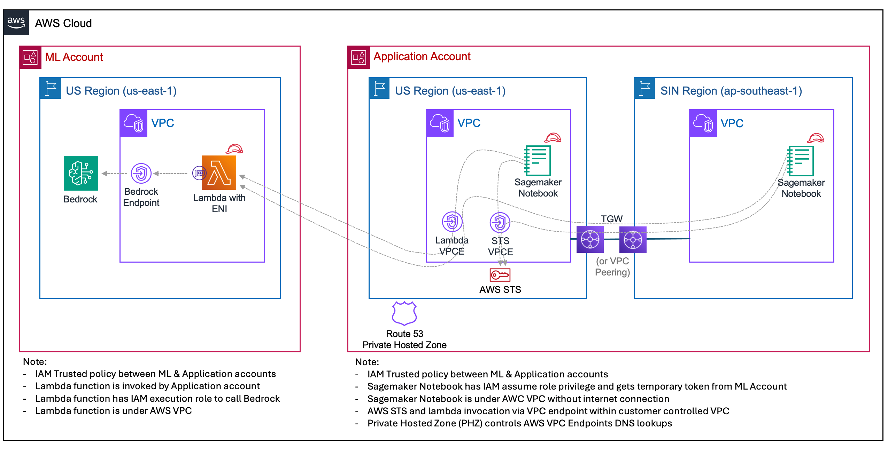
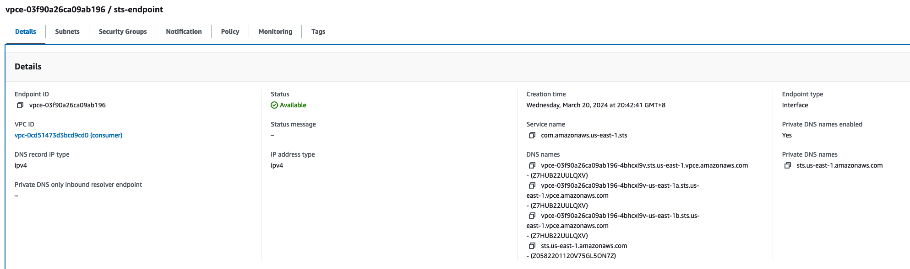
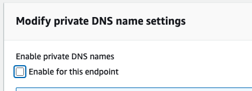
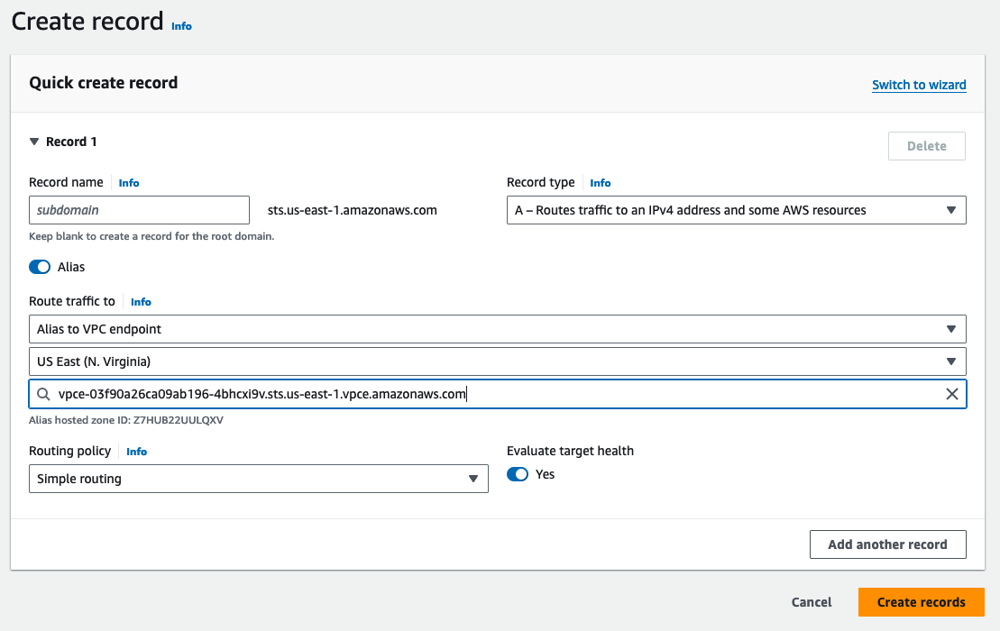
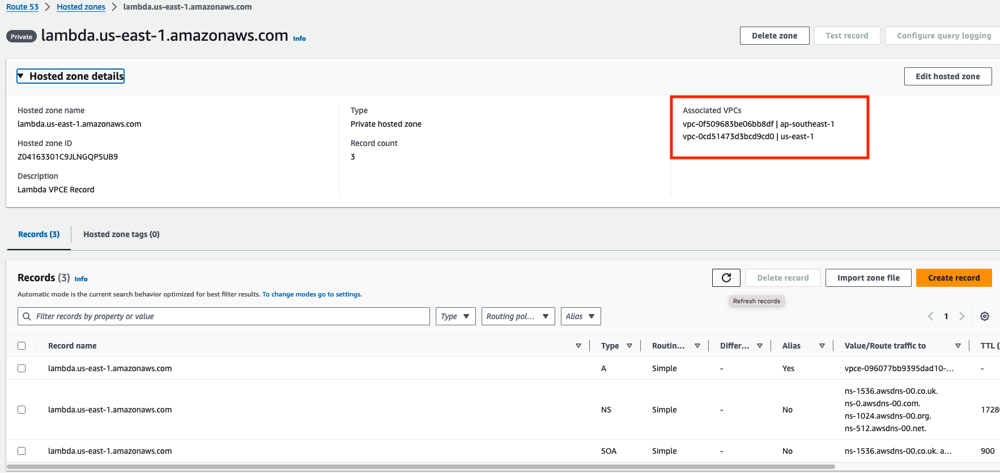
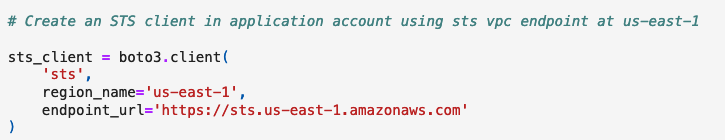

# Private link Multi-Account Setup

With AWS PrivateLink you can link your own VPCs, on-premise networks, and supported AWS services (e.g. Amazon Lambda, Amazon Bedrock) privately (private IP) without exposing your data to the public internet. See more details at 
[Build GenAI Applications Using Amazon Bedrock With AWS PrivateLink To Protect Your Data Privacy ](https://community.aws/concepts/build-GenAI-app-Bedrock-privateLink)

## Solution Components

### ML Account (us-east-1)

- **Bedrock**: AWS Managed Gen AI service responsible for the core logic of the LLM streaming architecture sitting in ML team account
- **Bedrock Endpoint**: The network endpoint that allows for the requests to invoke Bedrock service within the VPC.
- **ML Lambda with ENI**: A Lambda function equipped with an Elastic Network Interface (ENI) for VPC integration. It is responsible for invoking the Bedrock service using InvokeModelWithResponseStreamCommand to support streaming response.

### Application Account at us-east-1

- **Application user Notebook within VPC**: An AWS SageMaker Notebook instance with ENI configured to connect securely to remote AWS resources including Bedrock service offered by ML account.
- **Application Lambda with ENI**: A Lambda function with VPC integration to invoke requests within VPC to Bedrock service managed by ML team at us-east-1.
- **Lambda VPC Endpoint**: VPC endpoint for allowing Lambda within VPC to invoke AWS services (Bedrock) within the VPC.
- **Regional STS Endpoint**: VPC endpoint for the AWS Security Token Service (STS), facilitating secure token issuance for cross-account access from application account to ML account.
- **Transit Gateway (TGW)**: Enables network connectivity between VPCs at us-east-1 and ap-southeast-1.
- **Private Hosted Zone**: A DNS service allowing the mapping of domain names (STS and Lambda) to the service endpoints within the VPC.

### Application Account at ap-southeast-1

- **Application user Notebook within VPC**: An AWS SageMaker Notebook instance with ENI configured to connect securely to AWS resources including Bedrock service offered by ML account at us-east-1.

## Architecture Illustration

### 1. **Cross-Account Access** 
In order to let the incoming requests from Application account to execute the ML Lambda and invoke Bedrock service at us-east-1 under ML account, we use IAM and STS to assume role. The Application Lambda or SageMaker notebook assumes a role with necessary permissions to perform Lambda invoke action in the ML Account. Due to the requirement that Cross-account PrivateLink must be happening within the same region, both STS and Lambda VPC endpoints are set up at us-east-1.

### 2. **Invocation**: 

#### From the Application Lambda or SageMaker Notebook within the Application Account at us-east-1 
The request will invoke ML account's lambda at us-east-1. As the requester is sitting at private subnet under Application account, we leverage Lambda VPC endpoint at us-east-1 to faciliate the communication and access control from VPC to Lambda service. Once the request reaches the Lambda at ML account, it will invoke the Bedrock service through Bedrock VPC endpoint.

#### From the Application Lambda or SageMaker Notebook within the Application Account at ap-southeast-1 
The request will invoke  ML account's lambda at us-east-1. As the requester is sitting at private subnet of Application account outside of us-east-1 region, we need to send the request traffics from ap-southeast-1 to VPC endpoints located at us-east-1 through VPC peering or TGW. Once the request reaches the Lambda at ML account, it will invoke the Bedrock service through Bedrock VPC endpoint.

### 3. **DNS Resolve**: 
Since cross-account PrivateLink must be happening within same region, all VPC endpoints involved invoking ML Account Lambda and Bedrock service must be at us-east-1 in our example. In order to share Application account VPC endpoints provisioned at us-east-1 to other VPCs of Application account at other regions, we use Private Hosted Zone (PHZ).

First we need to disable DNS at STS VPC endpoint and Lambda VPC endpoint at us-east-1. 

We create Private Hosted Zones for sts.us-east-1.amazonaws.com and lambda.us-east-1.amazonaws.com and route traffic to corresponding vpc endpoints at us-east-1 region.

Then we associate each PHZ with VPCs in any region including us-east-1 at Application account that want to invoke Bedrock service at ML account.

After completing the PHZ setup, all Application account resources in private subnets of those VPCs will forward STS and Lambda invoke traffics to VPC endpoints at us-east-1 according to the settings of PHZ.

4. **Networking**: In order to route traffics from different Application Account VPCs to its VPC at us-east-1 for accessing STS and Lambda service, VPC peering or Transit Gateway would be needed to handle traffic routings.

5. **Security**: You need to configure Security Groups for each VPCE. Please ensure STS VPCE and Lambda VPCE at us-east-1 will accept incoming traffics coming from private subnets of other regions.

At the ML account, VPC endpoint for Bedrock service needs to be provision to allow VPC Lambda inside VPC invoking Bedrock service from private subnet.

6. **Logging and Monitoring**: Traffics are to be routed via ENI and VPC endpoints among private subnets. They can be recorded in VPC FlowLog at VPC setting and DNS Log at Route 53.

## Getting Started
To get started with this solution, follow these steps:

1. Create VPC Peering or TGW to link up VPC at us-east-1 with other VPCs for providing those VPCE resources.

2. Deploy STS VPC endpoint and Lambda VPC Endpoint at Application Account us-east-1 region, Bedrock VPC endpoint at ML account at us-east-1. Assign proper Security Group settings for VPCE.

3. If you are planning to deploy Python application to invoke cross-account Bedrock service using PrivateLink, your boto3 client for STS must use endpoint_url pointing to 'https://sts.us-east-1.amazonaws.com'. For details, please refer to [Application Team SageMaker Notebook at ap-southeast-1](https://github.com/aws-samples/multi-account-bedrock-llm-streaming/blob/main/advance-setup-privatelink-vpc/app-team-notebook-ap-southeast-1-private.ipynb)

4. Run the notebook at Application account ap-southeast-1 region. Try to invoke Bedrock service at us-east-1 through ML account.
